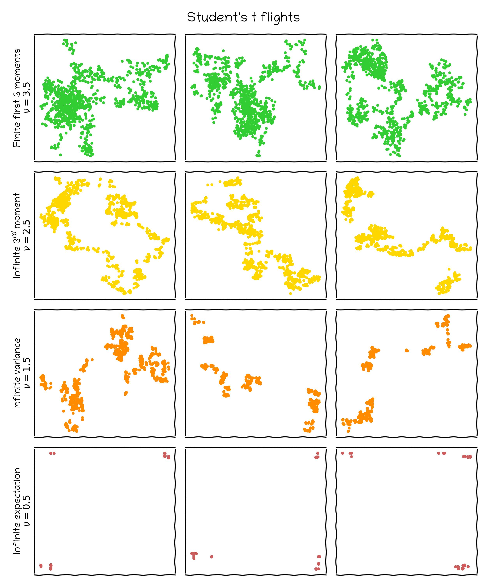

# A random walk with both nice and extreme distributions

⭐ This repo presents all the reproducible experiments for the **_A random walk with both nice and extreme distributions_ blogpost** available on Medium : **https://medium.com/@jb.excoffier/a-random-walk-with-both-nice-and-extreme-distributions-842a8cc3e048**. 

💻 It contains 
- a notebook to run all presented experiments (`Infinite_Random_Walk_Experiments.ipynb`).
- a setup file for the needed packages (`requirements.txt`).
- all images that were generated and used in the blogpost (in the `Images` directory). Of course as it involves randomness, running the notebook again will produce different results, but the main conclusions will still hold 👌

  

  

